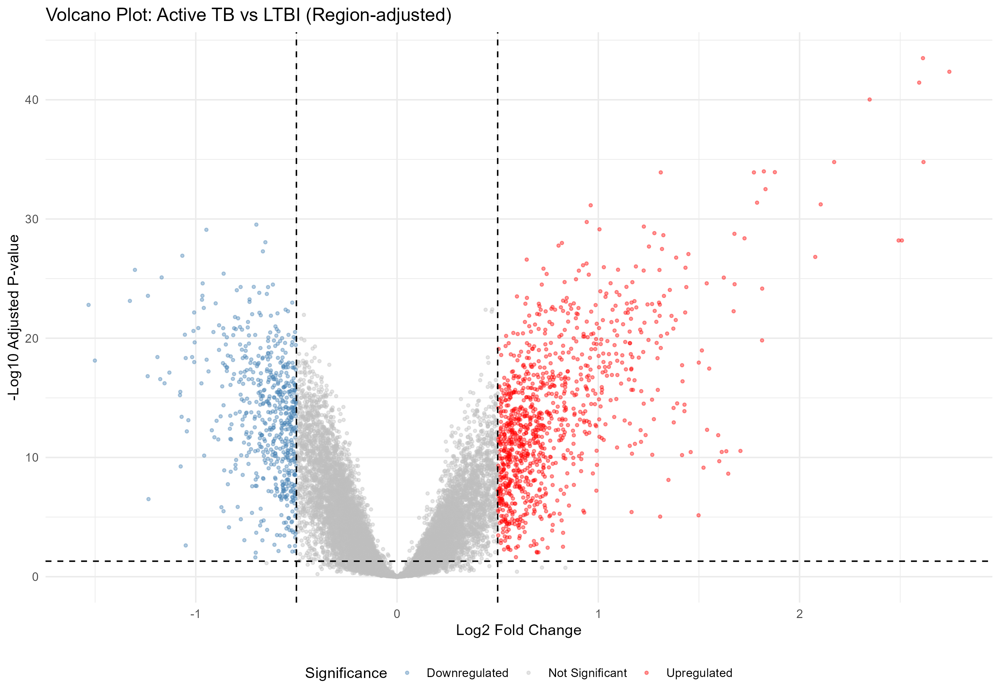
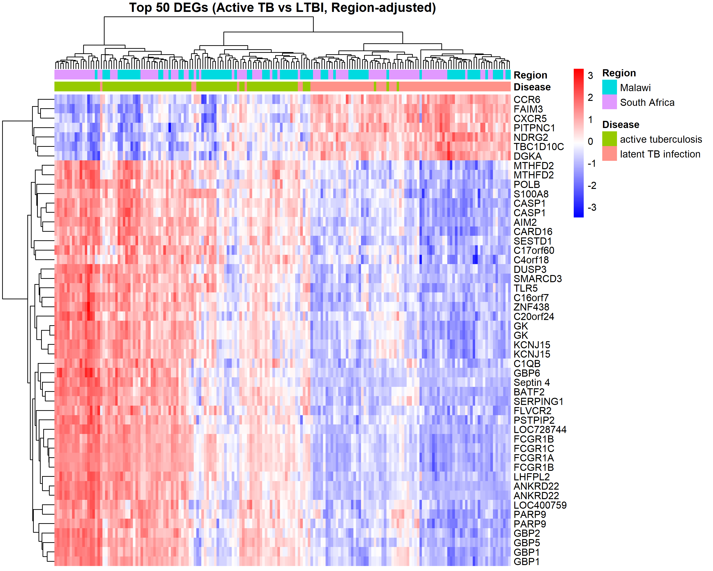

# Host Transcriptomic Analysis of Active and Latent Tuberculosis

This repository contains the analysis pipeline for a host transcriptomics study comparing active tuberculosis (TB) infection and latent TB infection using the GEO microarray dataset GSE37250.

## Project Overview

Tuberculosis remains a leading cause of infectious disease mortality worldwide. Understanding the host immune response during active vs. latent infection is critical for developing better diagnostics and therapeutics.
This project analyzes the GSE37250 microarray dataset to identify differentially expressed genes (DEGs) between active tuberculosis and latent TB infection, providing insights into host transcriptional responses during infection.

## Dataset

| Detail | Information |
| :--- | :--- |
| Dataset | [GSE37250](https://www.ncbi.nlm.nih.gov/geo/query/acc.cgi?acc=GSE37250) (GEO) |
| Platform | Affymetrix Human Genome U133 Plus 2.0 Array |
| Comparison | Active TB vs. latent TB infection (HIV-negative subset) |
| Probe sets analyzed | 23,823 |

## Methods

| Step | Tools Used |
| :--- | :--- |
| Data Retrieval | GEOparse |
| Sample Filtering | Pandas |
| Probe Annotation | GEO platform annotation |
| Data Processing | Duplicate probe removal (highest mean expression retained), missing value filtering |
| Differential Expression | SciPy (`ttest_ind`) |
| Multiple Testing Correction | Benjamini-Hochberg False Discovery Rate (statsmodels) |
| Visualization | Matplotlib, Seaborn |

## Repository Structure

TB-Host-Transcriptomics/
├── TB_Microarray_Analysis.ipynb
├── DE_results.csv
├── volcano_plot.png
├── heatmap.png
└── README.md

## Results

Differential expression analysis identified **8,577 significantly differentially expressed probe sets** between active tuberculosis and latent tuberculosis infection after Benjamini-Hochberg false discovery rate (FDR) correction (adjusted p-value < 0.05).
Applying an additional fold-change threshold (|log2FC| > 0.5) identified **1,452 upregulated** and **1,349 downregulated** probe sets in active TB compared with latent TB.
The volcano plot shows the distribution of differentially expressed probe sets, while the heatmap of the top 50 genes shows distinct transcriptional profiles between the two clinical groups.

### Volcano Plot

### Heatmap of Top 50 Differentially Expressed Genes

